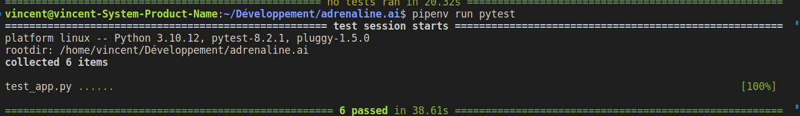

# adrenaline.ai

La documentation ci-dessous détaille les différentes étapes qui permettent de déployer, utiliser, tester et maintenir **Adrenaline.ai**.

## Déploiement

Cette section explique comment déployer l'application sur une ressource Azure Web App. Vous devrez au préalable disposer d'un abonnement Microsoft Azure et d'un serveur MySQL (vous pouvez si vous le souhaitez utiliser le service "Azure Database for MySQL flexible server" d'Azure).

### Mise en place du dépôt GitHub
- Pour commencer, créez un nouveau fork de ce dépôt GitHub en cliquant sur "Fork" en haut à droite de cette page.
- Installez les dépendances du projet en exécutant ces commandes :
```
pip install pipenv
pipenv install .
```
- Supprimez le dossier .github.
- Sur votre serveur MySQL, créez une base de données et donnez-lui le nom de votre choix.
- Exécutez la commande suivante dans le dossier où vous avez forké le dépôt GitHub :
```mysql -h <adresse de votre serveur MySQL> -u <votre nom d'utilisateur> -p <nom de votre base de données> < create_db.sql```
Ceci remplira la base de données que vous avez créée avec toutes les tables nécessaires à l'exécution de l'application.
- Exportez ensuite votre dépôt sur GitHub. 
- Sur l'interface de votre dépôt dans votre navigateur, rendez-vous dans les paramètres et créez les secrets suivants qui seront utilisés pour tester et déployer l'application:
    - FLASK_SESSION_KEY : donnez-lui la valeur que vous voulez. Cette variable est utilisée par l'application pour gérer les sessions des utilisateurs connectés
    - MYSQL_DB_NAME : le nom de votre base de données
    - MYSQL_HOST : l'adresse de la base de données
    - MYSQL_PWD : le mot de passe de votre base de données
    - MYSQL_USER : votre nom d'utilisateur sur votre serveur MySQL.

### Création et configuration de la ressource Microsoft Azure
- Rendez-vous ensuite sur le portail de Microsoft Azure et créez une ressource Azure Web App. Pendant la procédure de création, sélectionnez Linux comme système d'exploitation et Python comme environnement d'exécution. Par ailleurs, sélectionnez "Code" comme méthode de publication. Sélectionnez un abonnement, une tarification et une région de votre choix. 


- Dans l'onglet "Déploiement", activez le déploiement continu et connectez votre compte GitHub à Azure. Sélectionnez ensuite le dépôt où vous avez placé le code de l'application sur GitHub et une branche de votre choix.


Cette étape créera automatiquement un fichier de configuration pour GitHub Action dans votre dépôt. Vous pouvez ensuite valider la création de votre ressource Azure en cliquant sur le bouton en surbrillance en bas de l'écran.

- la création de votre ressource prendra quelques minutes. Lorsqu'elle est terminée, rendez-vous sur la page de votre ressource Azure. Cliquez sur "Paramètres" à gauche puis rendez-vous dans la section "Variables d'environnement".
- Sur l'écran qui apparaît, créez cinq variables d'environnement **qui portent le même nom et ont les mêmes valeurs que les cinq variables définies plus haut**. Votre écran devrait ressembler à ceci :


La ressource sera automatiquement relancée. Votre application est maintenant disponible. Pour y accéder suivez le lien indiqué sur la page d'accueil de votre ressource Azure.

## Automatiser les tests

Adrenaline.ai est fourni avec des tests qui visent à vérifier le bon fonctionnement de l'application. Vous pouvez exécuter ces tests localement en utilisant les commandes suivantes :
```
export FLASK_SESSION_KEY="<n'importe quelle valeur>"
export MYSQL_DB_NAME="<le nom de votre base de données>"
export MYSQL_HOST="<l'adresse de la base de données>"
export MYSQL_PWD="<le mot de passe de votre base de données>"
export MYSQL_USER="<votre nom d'utilisateur sur votre serveur MySQL>"
pipenv run pytest
```

Vous devriez voir apparaître ceci dans votre terminal :



Ces tests sont utiles si vous souhaitez modifier le code. Ils vous permettent de vous assurer que les modifications apportées n'ont pas introduit de bug dans l'application. Il est fortement recommandé de les automatiser à l'aide de GitHub Action afin qu'ils soient exécutés à chaque fois que vous poussez du code sur votre dépôt GitHub. Pour cela, ouvrez le fichier YAML qui a automatiquement été généré par Azure (il se trouve dans le dossier de votre dépôt, dans .github/workflows). Modifiez la section "on" au début du fichier pour qu'elle ressemble à ceci :

```
on:
  push:
    branches:
      - main
  pull_request:
    branches:
      - main
  workflow_dispatch:  
```

Ensuite, dans la section "jobs", rajoutez ce bloc de code avant "build" :

```
test:
    runs-on: ubuntu-latest

    strategy:
      matrix:
        # Run in all these versions of Python
        python-version: [3.8, 3.9]
    steps:
        # Setup which version of Python to use
      - name: Checkout repository files
        uses: actions/checkout@v2
      - name: Set Up Python ${{ matrix.python-version }}
        uses: actions/setup-python@v2
        with:
          python-version: ${{ matrix.python-version }}

        # Display the Python version being used
      - name: Display Python version
        run: python -c "import sys; print(sys.version)"

        # Install pytest
      - name: Install pytest and dependencies
        run: |
          python -m pip install --upgrade pip
          pip install pipenv
          pipenv install

        # Run the tests
      - name: Run tests
        run: |
          pipenv run pytest
        env: 
          MYSQL_HOST: ${{ secrets.MYSQL_HOST }}
          MYSQL_USER: ${{ secrets.MYSQL_USER }}
          MYSQL_PWD: ${{ secrets.MYSQL_PWD }}
          MYSQL_DB_NAME: ${{ secrets.MYSQL_DB_NAME }}
          FLASK_SESSION_KEY: ${{ secrets.FLASK_SESSION_KEY }}
```

Ces modifications indiquent à GitHub Action que les tests doivent être exécutés à chaque fois que du code est est intégré à la branche "main" (pensez à modifier ces lignes en conséquence si vous utilisez une branche portant un autre nom), avec Python 3.8 et 3.9.


