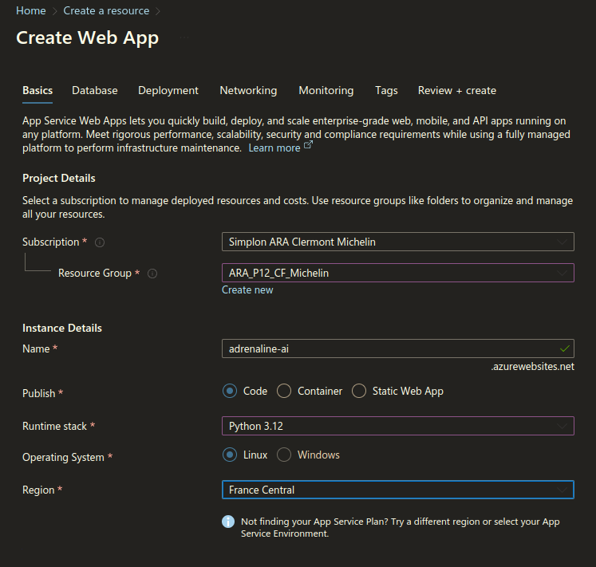
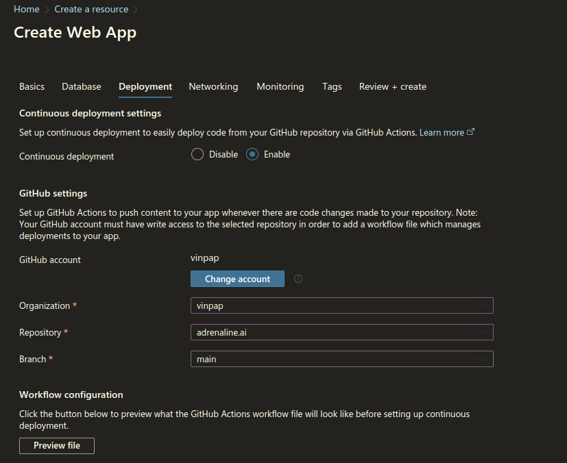
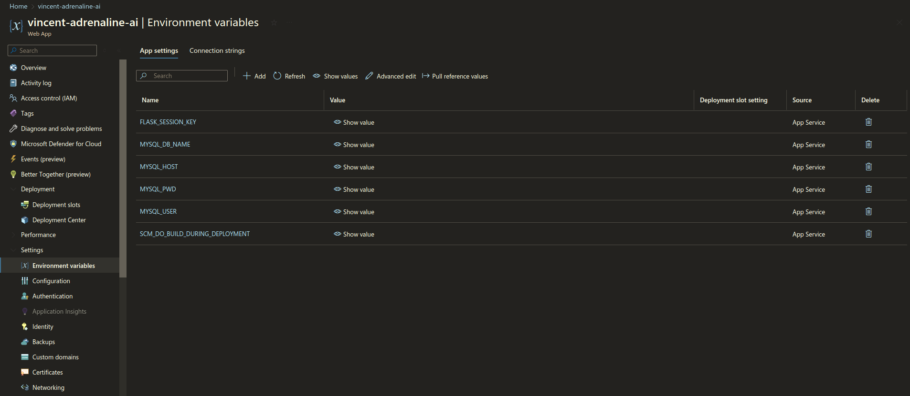

# adrenaline.ai

La documentation ci-dessous détaille les différentes étapes qui permettent de déployer, utiliser, tester et maintenir **Adrenaline.ai**.

## Déploiement

Cette section explique comment déployer l'application sur une ressource Azure Web App. Vous devrez au préalable disposer des éléments suivants d'un abonnement Microsoft Azure et d'un serveur MySQL (vous pouvez si vous le souhaitez utiliser le service "Azure Database for MySQL flexible server" d'Azure).

### Mise en place du dépôt GitHub
- Pour commencer, créez un nouveau fork de ce dépôt GitHub en cliquant sur "Fork" en haut à droite de cette page.
- Supprimez le dossier .github.
- Sur votre serveur MySQL, créez une base de données et donnez-lui le nom de votre choix.
- Exécutez la commande suivante dans le dossier où vous avez forké le dépôt GitHub :
```mysql -h <adresse de votre serveur MySQL> -u <votre nom d'utilisateur> -p <nom de votre base de données> < create_db.sql```
Ceci remplira la base de données que vous avez créée avec toutes les tables nécessaires à l'exécution de l'application.
- Exportez ensuite votre dépôt sur GitHub. 
- Sur l'interface de votre dépôt dans votre navigateur, rendez-vous dans les paramètres et créez les secrets suivants qui seront utilisés pour tester et déployer l'application:
    - FLASK_SESSION_KEY : donnez-lui la valeur que vous voulez. Cette variable est utilisée par l'application pour gérer les sessions des utilisateurs connectés
    - MYSQL_DB_NAME : le nom de votre base de données
    - MYSQL_HOST : l'adresse de la base de données
    - MYSQL_PWD : le mot de passe de votre base de données
    - MYSQL_USER : votre nom d'utilisateur sur votre serveur MySQL.

### Création et configuration de la ressource Microsoft Azure
- Rendez-vous ensuite sur le portail de Microsoft Azure et créez une ressource Azure Web App. Pendant la procédure de création, sélectionnez Linux comme système d'exploitation et Python comme environnement d'exécution. Par ailleurs, sélectionnez "Code" comme méthode de publication. Sélectionnez un abonnement, une tarification et une région de votre choix. 

- Dans l'onglet "Déploiement", activez le déploiement continu et connectez votre compte GitHub à Azure. Sélectionnez ensuite le dépôt où vous avez placé le code de l'application sur GitHub et une branche de votre choix.


Cette étape créera automatiquement un fichier de configuration pour GitHub Action dans votre dépôt. Vous pouvez ensuite valider la création de votre ressource Azure en cliquant sur le bouton en surbrillance en bas de l'écran.

- la création de votre ressource prendra quelques minutes. Lorsqu'elle est terminée, rendez-vous sur la page de votre ressource Azure. Cliquez sur "Paramètres" à gauche puis rendez-vous dans la section "Variables d'environnement".
- Sur l'écran qui apparaît, créez cinq variables d'environnement **qui portent le même nom et ont les mêmes valeurs que les cinq variables définies plus haut**. Votre écran devrait ressembler à ceci :


La ressource sera automatiquement relancée. Votre application est maintenant disponible. Pour y accéder suivez le lien indiqué sur la page d'accueil de votre ressource Azure.

## Automatiser les tests

DIRE COMMENT CHECKER LE RÉSULTAT DU PIPELINE GH ACTION ET COMMENT MODIFIER LES TRIGGERS


L'application est actuellement déployée sur Microsoft Azure à [cette adresse](https://vincent-adrenaline-ai.azurewebsites.net/).

Les instructions suivantes expliquent comment déployer l'application sur un serveur Linux sur lequel Python est déjà installé.
- pour commencer, cloner ce dépôt GitHub grâce à la commande ```git clone https://github.com/vinpap/adrenaline.ai.git```
-